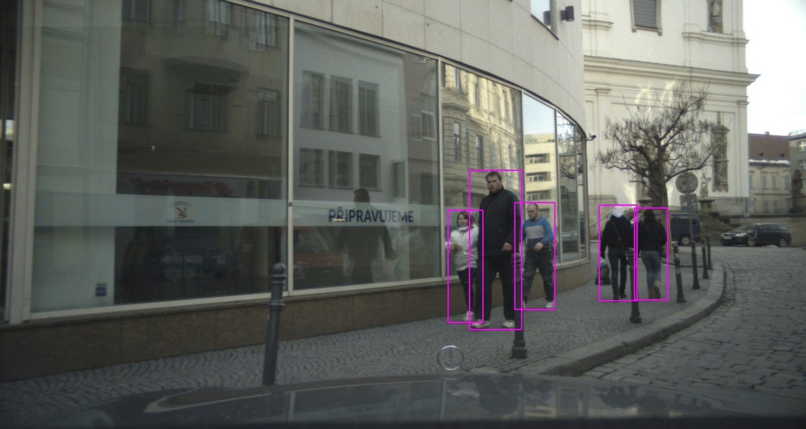

# dairly_learning
主要内容：有关计算机视觉，NLP等公众号内容学习笔记日更记录

更新开始时间：2021.3.21

更新今日时间：2021.4.24

------

## :paperclip:  今日要点

1. [不容忽视的问题：行人检测器的泛化能力](https://mp.weixin.qq.com/s/UKp6jbKqyXoO27sHT_Dwjg)         :star::star:
   - 主要内容：适用于面向自动驾驶的行人检测渐进式训练流程
   - paper: [Generalizable Pedestrian Detection: The Elephant In The Room](https://arxiv.org/pdf/2003.08799.pdf)
   - code: [https://github.com/hasanirtiza/Pedestron](https://github.com/hasanirtiza/Pedestron)
   - Tips: 通过将模型从最大（但距目标域最远）到最小（但最接近目标域）的数据集上进行逐步微调，并且无需在目标数据集上进行训练，就可以在一些数据集上获得显著的性能提升。

2. [我的机器学习和深度学习绘图模板.pptx](https://mp.weixin.qq.com/s/V2UAljaA0Xl20CB7Gcun_A)       :star::star:
   - 主要内容：适合深度学习的绘图的模板
   - 源码：[https://github.com/dair-ai/ml-visuals](https://github.com/dair-ai/ml-visuals)
   - 链接：[https://pan.baidu.com/s/1abCHH6YtsPBCyXh_lhIxAA](https://pan.baidu.com/s/1abCHH6YtsPBCyXh_lhIxAA) 提取码：6r80
   - 参考阅读：

3. [数据分析最有用的25个 Matplotlib图](https://mp.weixin.qq.com/s/BXi8RaRjze0w_PrOVAb_XQ)       :star::star:
   - 主要内容：利用Matplolib绘制数据可视化图

   - Tips: 做比赛数据可视化还是写论文的分布图都可以用到，非常实用有代码分析详解

4. [15张图表带你速览2021人工智能最新趋势](https://mp.weixin.qq.com/s/_XFlCoop3LIX8_0Y5fN4NQ)       :star::star:
   - 主要内容：2021年度人工智能最新的研究趋势和进展
   - Tips： 分析了资本、政策对AI技术的影响，以及深度学习、图像识别、语言识别等AI主要子领域的研究。

5. [多传感器融合标定方法汇总](https://mp.weixin.qq.com/s/ylzE85_QBCyKQkMIsl2R6A)       :star::star:
   - 主要内容：常见的一些单传感器、多传感器的标定融合paper、工程代码
6. [基于OpenCV的单目摄像机测距](https://mp.weixin.qq.com/s/MoFKPy0i_lvJ4i6x6ymwnQ)       :star::star:
   - 主要内容：基于OpenCV的单目摄像机测距，一个demo

7. [谈谈NLP下一个主战场：万亿参数的预训练模型！](https://mp.weixin.qq.com/s/vx1HykDP8fTPALcndKxQYQ)       :star::star:
   - 主要内容：从数据、算力和分布式训练技术三个方面讲解语言模型规模的上限问题
   - Tips：夸了一波百度，主要是工业界的解决方案
8. [270亿参数、刷榜CLUE，阿里达摩院发布最大中文预训练语言模型PLUG（开放测试）](https://mp.weixin.qq.com/s/klHSrEzka6byEBvNjrCXOA)       :star::star:
   - 主要内容：阿里达摩院发布最大中文预训练语言模型PLUG
   - 测试地址：[https://nlp.aliyun.com/portal#/BigText_chinese](https://nlp.aliyun.com/portal#/BigText_chinese)

## 

## :paperclip:  历史更新

<pre>

2021年

3月

    1. <a href="notes/202103/0321.md" target="_blank">公众号内容拓展学习笔记（2021.3.21）</a>
    2. <a href="notes/202103/0322.md" target="_blank">公众号内容拓展学习笔记（2021.3.22）</a>
    3. <a href="notes/202103/0323.md" target="_blank">公众号内容拓展学习笔记（2021.3.23）</a>
    4. <a href="notes/202103/0324.md" target="_blank">公众号内容拓展学习笔记（2021.3.24）</a>
    5. <a href="notes/202103/0325.md" target="_blank">公众号内容拓展学习笔记（2021.3.25）</a>
    6. <a href="notes/202103/0326.md" target="_blank">公众号内容拓展学习笔记（2021.3.26）</a>
    7. <a href="notes/202103/0327.md" target="_blank">公众号内容拓展学习笔记（2021.3.27）</a>
    8. <a href="notes/202103/0328.md" target="_blank">公众号内容拓展学习笔记（2021.3.28）</a>
    9. <a href="notes/202103/0329.md" target="_blank">公众号内容拓展学习笔记（2021.3.29）</a>
    10. <a href="notes/202103/0330.md" target="_blank">公众号内容拓展学习笔记（2021.3.30）</a>
    11. <a href="notes/202103/0331.md" target="_blank">公众号内容拓展学习笔记（2021.3.31）</a>

4月

    1. <a href="notes/202104/0401.md" target="_blank">公众号内容拓展学习笔记（2021.4.1）</a>
    2. <a href="notes/202104/0402.md" target="_blank">公众号内容拓展学习笔记（2021.4.2）</a>
    3. <a href="notes/202104/0403.md" target="_blank">公众号内容拓展学习笔记（2021.4.3）</a>
    4. <a href="notes/202104/0404.md" target="_blank">公众号内容拓展学习笔记（2021.4.4）</a>
    5. <a href="notes/202104/0405.md" target="_blank">公众号内容拓展学习笔记（2021.4.5）</a>
    6. <a href="notes/202104/0406.md" target="_blank">公众号内容拓展学习笔记（2021.4.6）</a>
    7. <a href="notes/202104/0407.md" target="_blank">公众号内容拓展学习笔记（2021.4.7）</a>
    8. <a href="notes/202104/0408.md" target="_blank">公众号内容拓展学习笔记（2021.4.8）</a>
    9. <a href="notes/202104/0409.md" target="_blank">公众号内容拓展学习笔记（2021.4.9）</a>
    10. <a href="notes/202104/0410.md" target="_blank">公众号内容拓展学习笔记（2021.4.10）</a>
    11. <a href="notes/202104/0411.md" target="_blank">公众号内容拓展学习笔记（2021.4.11）</a>
    12. <a href="notes/202104/0412.md" target="_blank">公众号内容拓展学习笔记（2021.4.12）</a>
    13. <a href="notes/202104/0413.md" target="_blank">公众号内容拓展学习笔记（2021.4.13）</a>
    14. <a href="notes/202104/0414.md" target="_blank">公众号内容拓展学习笔记（2021.4.14）</a>
    15. <a href="notes/202104/0415.md" target="_blank">公众号内容拓展学习笔记（2021.4.15）</a>
    16. <a href="notes/202104/0416.md" target="_blank">公众号内容拓展学习笔记（2021.4.16）</a>
    17. <a href="notes/202104/0417.md" target="_blank">公众号内容拓展学习笔记（2021.4.17）</a>
    18. <a href="notes/202104/0418.md" target="_blank">公众号内容拓展学习笔记（2021.4.18）</a>
    19. <a href="notes/202104/0419.md" target="_blank">公众号内容拓展学习笔记（2021.4.19）</a>
    20. <a href="notes/202104/0420.md" target="_blank">公众号内容拓展学习笔记（2021.4.20）</a>
    21. <a href="notes/202104/0421.md" target="_blank">公众号内容拓展学习笔记（2021.4.21）</a>
    22. <a href="notes/202104/0422.md" target="_blank">公众号内容拓展学习笔记（2021.4.22）</a>
    23. <a href="notes/202104/0423.md" target="_blank">公众号内容拓展学习笔记（2021.4.23）</a>
    24. <a href="notes/202104/0424.md" target="_blank">公众号内容拓展学习笔记（2021.4.24）</a>

</pre>

## :paperclip:  Others

- 由于图片权限问题，[GitHub](https://github.com/xiaoxuebajie/dairly_learning)是完整版，可以点点 star
- 星标的数量是与个人相关程度，不代表文章内容的好坏
- 关注我的[个人网站](http://www.cvbds.cn/)
- 关注我的[CSDN](https://mp.csdn.net/console/article)博客
- 关注我的[哔哩哔哩](https://space.bilibili.com/424394389?spm_id_from=333.788.b_765f7570696e666f.1)
- 关注我的公众号CV伴读社

