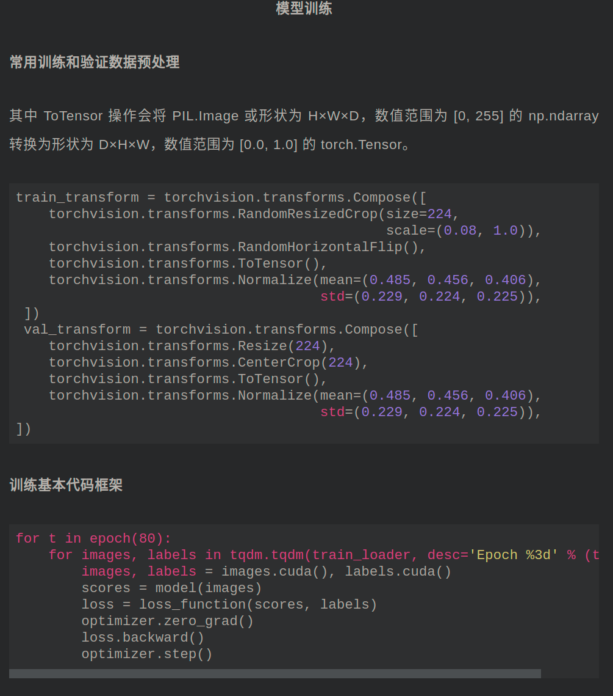

# dairly_learning
主要内容：有关计算机视觉，NLP等公众号内容学习笔记日更记录

更新开始时间：2021.3.21

更新今日时间：2022.2.27

------

## :paperclip:  今日要点

1. [轻量级目标检测GiraffeDet！阿里最新成果！ICLR2022！性能更优！](https://mp.weixin.qq.com/s/BOVmwERPMNKliKne3b8Pjw)         :star::star:
   - Abstract: 阿里最新成果轻量级目标检测GiraffeDet
   - Paper: [GiraffeDet: A Heavy-Neck Paradigm for Object Detection](https://arxiv.org/abs/2202.04256)
   - Code: [https://github.com/shanglianlm0525/CvPytorch](https://github.com/shanglianlm0525/CvPytorch)
   - Tips:  GiraffeDet 使用了一个非常轻的主干和一个非常深和大的颈部模块，这种结构可进行不同空间尺度以及不同级别潜在语义的密集信息交换。

2. [【源头活水】AAAI 2022：基于transformer的多曝光融合模型TransMEF](https://mp.weixin.qq.com/s/ISkuqLf_PeAEg4E_Is7-wg)       :star::star:
   - Abstract: 基于transformer的多曝光融合模型TransMEF
   - Paper: [TransMEF: A Transformer-Based Multi-Exposure Image Fusion Framework via Self-Supervised Multi-Task Learning](https://arxiv.org/abs/2112.01030)
   - Code: [https://github.com/miccaiif/TransMEF](https://github.com/miccaiif/TransMEF)
   - Tips: 针对多曝光图像的特点从空域和频域设计了三个高效的自监督重建任务，并通过多任务学习的方式进行训练，性能表现SOTA。

3. [清华IEEE论文：利用新型训练方法，帮自动驾驶决策摆脱「路侧干扰」](https://mp.weixin.qq.com/s/wdKn3JJ1pens3eqkqfKjvA)       :star::star:
   - Abstract: 利用新型训练方法，帮自动驾驶决策摆脱「路侧干扰」
   - Paper: [End-to-End Self-Driving Approach Independent of Irrelevant Roadside Objects With Auto-Encoder](https://ieeexplore.ieee.org/document/9187264)
   - Tips: 本文提出了一个基于自动编码器实现的新训练方法，使其能够忽略输入图像中的无关特征，同时保留相关特征。与现有的端到端提取方法相比，该方法只需要图像级标签，降低了标记成本。

4. [基于改进 YOLOV3 的违禁品检测方案](https://mp.weixin.qq.com/s/8-zCyQm0y5SUPv5g9LdGiQ)       :star::star:
   - Abstract: 基于改进 YOLOV3 的违禁品检测方案
   - Tips: 本文提出了一种基于 YOLO V3 的改进的违禁品检测算法，通过改进和优化数据增广方式、检测框架的 Loss 函数等方法，较好的提升了模型的检测精度和运行效率。

5. [人脸识别常用开源数据集大全](https://mp.weixin.qq.com/s/HM4DjIGs0go7kgoYFAkJsQ)       :star::star:
   - Abstract: 人脸识别常用开源数据集大全
   - Tips: 总结整理了10个开源的人脸识别数据集，并附有相关下载链接。

6. [PyTorch常用代码段整理合集，建议收藏！](https://mp.weixin.qq.com/s/KsAk7gsWG-Mx1xubGfLQGw)       :star::star:
   - Abstract: PyTorch常用代码段整理合集
   - Tips: 涵盖了绝大部分Pytorch常用操作代码

## :paperclip:  历史更新

<pre>

2021年

3月

    1. <a href="notes/202103/0321.md" target="_blank">公众号内容拓展学习笔记（2021.3.21）</a>
    2. <a href="notes/202103/0322.md" target="_blank">公众号内容拓展学习笔记（2021.3.22）</a>
    3. <a href="notes/202103/0323.md" target="_blank">公众号内容拓展学习笔记（2021.3.23）</a>
    4. <a href="notes/202103/0324.md" target="_blank">公众号内容拓展学习笔记（2021.3.24）</a>
    5. <a href="notes/202103/0325.md" target="_blank">公众号内容拓展学习笔记（2021.3.25）</a>
    6. <a href="notes/202103/0326.md" target="_blank">公众号内容拓展学习笔记（2021.3.26）</a>
    7. <a href="notes/202103/0327.md" target="_blank">公众号内容拓展学习笔记（2021.3.27）</a>
    8. <a href="notes/202103/0328.md" target="_blank">公众号内容拓展学习笔记（2021.3.28）</a>
    9. <a href="notes/202103/0329.md" target="_blank">公众号内容拓展学习笔记（2021.3.29）</a>
    10. <a href="notes/202103/0330.md" target="_blank">公众号内容拓展学习笔记（2021.3.30）</a>
    11. <a href="notes/202103/0331.md" target="_blank">公众号内容拓展学习笔记（2021.3.31）</a>

4月

    1. <a href="notes/202104/0401.md" target="_blank">公众号内容拓展学习笔记（2021.4.1）</a>
    2. <a href="notes/202104/0402.md" target="_blank">公众号内容拓展学习笔记（2021.4.2）</a>
    3. <a href="notes/202104/0403.md" target="_blank">公众号内容拓展学习笔记（2021.4.3）</a>
    4. <a href="notes/202104/0404.md" target="_blank">公众号内容拓展学习笔记（2021.4.4）</a>
    5. <a href="notes/202104/0405.md" target="_blank">公众号内容拓展学习笔记（2021.4.5）</a>
    6. <a href="notes/202104/0406.md" target="_blank">公众号内容拓展学习笔记（2021.4.6）</a>
    7. <a href="notes/202104/0407.md" target="_blank">公众号内容拓展学习笔记（2021.4.7）</a>
    8. <a href="notes/202104/0408.md" target="_blank">公众号内容拓展学习笔记（2021.4.8）</a>
    9. <a href="notes/202104/0409.md" target="_blank">公众号内容拓展学习笔记（2021.4.9）</a>
    10. <a href="notes/202104/0410.md" target="_blank">公众号内容拓展学习笔记（2021.4.10）</a>
    11. <a href="notes/202104/0411.md" target="_blank">公众号内容拓展学习笔记（2021.4.11）</a>
    12. <a href="notes/202104/0412.md" target="_blank">公众号内容拓展学习笔记（2021.4.12）</a>
    13. <a href="notes/202104/0413.md" target="_blank">公众号内容拓展学习笔记（2021.4.13）</a>
    14. <a href="notes/202104/0414.md" target="_blank">公众号内容拓展学习笔记（2021.4.14）</a>
    15. <a href="notes/202104/0415.md" target="_blank">公众号内容拓展学习笔记（2021.4.15）</a>
    16. <a href="notes/202104/0416.md" target="_blank">公众号内容拓展学习笔记（2021.4.16）</a>
    17. <a href="notes/202104/0417.md" target="_blank">公众号内容拓展学习笔记（2021.4.17）</a>
    18. <a href="notes/202104/0418.md" target="_blank">公众号内容拓展学习笔记（2021.4.18）</a>
    19. <a href="notes/202104/0419.md" target="_blank">公众号内容拓展学习笔记（2021.4.19）</a>
    20. <a href="notes/202104/0420.md" target="_blank">公众号内容拓展学习笔记（2021.4.20）</a>
    21. <a href="notes/202104/0421.md" target="_blank">公众号内容拓展学习笔记（2021.4.21）</a>
    22. <a href="notes/202104/0422.md" target="_blank">公众号内容拓展学习笔记（2021.4.22）</a>
    23. <a href="notes/202104/0423.md" target="_blank">公众号内容拓展学习笔记（2021.4.23）</a>
    24. <a href="notes/202104/0424.md" target="_blank">公众号内容拓展学习笔记（2021.4.24）</a>
    25. <a href="notes/202104/0425.md" target="_blank">公众号内容拓展学习笔记（2021.4.25）</a>
    26. <a href="notes/202104/0426.md" target="_blank">公众号内容拓展学习笔记（2021.4.26）</a>
    27. <a href="notes/202104/0427.md" target="_blank">公众号内容拓展学习笔记（2021.4.27）</a>
    28. <a href="notes/202104/0428.md" target="_blank">公众号内容拓展学习笔记（2021.4.28）</a>
    29. <a href="notes/202104/0429.md" target="_blank">公众号内容拓展学习笔记（2021.4.29）</a>
    30. <a href="notes/202104/0430.md" target="_blank">公众号内容拓展学习笔记（2021.4.30）</a>

5月

    1. <a href="notes/202105/0501.md" target="_blank">公众号内容拓展学习笔记（2021.5.1）</a>
    2. <a href="notes/202105/0502.md" target="_blank">公众号内容拓展学习笔记（2021.5.2）</a>
    3. <a href="notes/202105/0503.md" target="_blank">公众号内容拓展学习笔记（2021.5.3）</a>
    4. <a href="notes/202105/0504.md" target="_blank">公众号内容拓展学习笔记（2021.5.4）</a>
    5. <a href="notes/202105/0505.md" target="_blank">公众号内容拓展学习笔记（2021.5.5）</a>
    6. <a href="notes/202105/0506.md" target="_blank">公众号内容拓展学习笔记（2021.5.6）</a>
    7. <a href="notes/202105/0507.md" target="_blank">公众号内容拓展学习笔记（2021.5.7）</a>
    8. <a href="notes/202105/0508.md" target="_blank">公众号内容拓展学习笔记（2021.5.8）</a>
    9. <a href="notes/202105/0509.md" target="_blank">公众号内容拓展学习笔记（2021.5.9）</a>
    10. <a href="notes/202105/05010.md" target="_blank">公众号内容拓展学习笔记（2021.5.10）</a>
    11. <a href="notes/202105/05011.md" target="_blank">公众号内容拓展学习笔记（2021.5.11）</a>
    12. <a href="notes/202105/05012.md" target="_blank">公众号内容拓展学习笔记（2021.5.12）</a>
    13. <a href="notes/202105/05013.md" target="_blank">公众号内容拓展学习笔记（2021.5.13）</a>
    14. <a href="notes/202105/05014.md" target="_blank">公众号内容拓展学习笔记（2021.5.14）</a>
    15. <a href="notes/202105/05015.md" target="_blank">公众号内容拓展学习笔记（2021.5.15）</a>
    16. <a href="notes/202105/05016.md" target="_blank">公众号内容拓展学习笔记（2021.5.16）</a>
    17. <a href="notes/202105/05027.md" target="_blank">公众号内容拓展学习笔记（2021.5.27）</a>

9月

    1. <a href="notes/202109/0930.md" target="_blank">公众号内容拓展学习笔记（2021.9.30）</a>

10月

    1. <a href="notes/202110/1001.md" target="_blank">公众号内容拓展学习笔记（2021.10.1）</a>
    2. <a href="notes/202110/1002.md" target="_blank">公众号内容拓展学习笔记（2021.10.2）</a>
    3. <a href="notes/202110/1003.md" target="_blank">公众号内容拓展学习笔记（2021.10.3）</a>
    4. <a href="notes/202110/1004.md" target="_blank">公众号内容拓展学习笔记（2021.10.4）</a>
    5. <a href="notes/202110/1006.md" target="_blank">公众号内容拓展学习笔记（2021.10.6）</a>
    6. <a href="notes/202110/1008.md" target="_blank">公众号内容拓展学习笔记（2021.10.8）</a>
    7. <a href="notes/202110/1016.md" target="_blank">公众号内容拓展学习笔记（2021.10.16）</a>
    8. <a href="notes/202110/1018.md" target="_blank">公众号内容拓展学习笔记（2021.10.18）</a>

</pre>
<pre>

2022年

1月

    1. <a href="notes/202201/0120.md" target="_blank">公众号内容拓展学习笔记（2022.1.20）</a>

2月

    1. <a href="notes/202202/0225.md" target="_blank">公众号内容拓展学习笔记（2022.2.25）</a>
    2. <a href="notes/202202/0226.md" target="_blank">公众号内容拓展学习笔记（2022.2.26）</a>
    3. <a href="notes/202202/0227.md" target="_blank">公众号内容拓展学习笔记（2022.2.27）</a>

</pre>

## :paperclip:  Others

- 由于图片权限问题，[GitHub](https://github.com/xiaoxuebajie/dairly_learning)是完整版，可以点点 star
- 星标的数量是与个人相关程度，不代表文章内容的好坏
- 关注我的[个人网站](http://www.cvbds.cn/)
- 关注我的[CSDN](https://blog.csdn.net/xiaoxuebajie)博客
- 关注我的[哔哩哔哩](https://space.bilibili.com/424394389)
- 关注我的公众号CV伴读社

