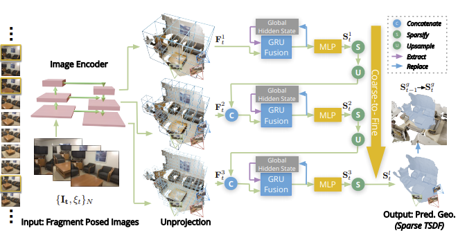

# 公众号内容拓展学习笔记（2021.4.10）

------

## :paperclip:  今日要点

1. [SOTA来啦！BERT又又又又又又魔改了！DeBERTa登顶GLUE~](https://mp.weixin.qq.com/s/5eLEa5fiAgDEqs75tcCAsQ)         :star::star:
   - 主要内容：DeBERTa是对BERT的改造刷新了GLUE的榜首。
   - 论文：[DeBERTa: Decoding-enhanced BERT with Disentangled Attention](https://arxiv.org/abs/2006.03654)
   - GitHub：[https://github.com/microsoft/DeBERTa/tree/master/DeBERTa/deberta](https://github.com/microsoft/DeBERTa/tree/master/DeBERTa/deberta)
   - Tips：改造体现在三个方面 1.分散注意力 2.增强解码器 3. 训练trick

2. [PluckerNet：一种基于3D线匹配的配准网络（CVPR2021）](https://mp.weixin.qq.com/s/nAzjBlvPhpKgpojjlkvFvA)       :star::star:
   - 主要内容：一种3D线匹配的配准网络PluckerNet
   - 论文：[PluckerNet: Learn to Register 3D Line Reconstructions](https://arxiv.org/abs/2012.01096)
   - GitHub：[https://github.com/Liumouliu/PlueckerNet](https://github.com/Liumouliu/PlueckerNet)

3. [CVPR 2021| 重新思考文本分割：新的数据集及一种针对文本特征的改进分割方法](https://mp.weixin.qq.com/s/yVxrz1d-LaxIvP5kpIwaFQ)        :star::star:
   - 主要内容：一个带有比较全面的标注的大型文本分割数据集TextSeg以及一种文字分割方法TexRNet
   - 论文：[Rethinking Text Segmentation: A Novel Dataset and A Text-Specific Refinement Approach](https://arxiv.org/abs/2011.14021)
   - GitHub：[https://github.com/SHI-Labs/Rethinking-TextSegmentation](https://github.com/SHI-Labs/Rethinking-TextSegmentation)
   

4. [【面试招聘】如何写出发光的简历｜附10个模版](https://mp.weixin.qq.com/s/9yU5vcOlBDdRgvJ5z4dk1g)       :star::star:
   - 主要内容：简历模板以及如何写简历
5. [CVPR 2021 | 单目实时3D场景稠密重建](https://mp.weixin.qq.com/s/QUzzNndPGnNC4XvoTbIj8A)       :star::star:
   - 主要内容：已知位姿条件下进行单目实时3D场景重建
   - 论文：[NeuralRecon: Real-Time Coherent 3D Reconstruction from Monocular Video](https://arxiv.org/pdf/2104.00681.pdf)
   - ＧitHub：[https://github.com/zju3dv/NeuralRecon](https://github.com/zju3dv/NeuralRecon)

6. [6 年招聘 8000 多人引发争议：高校割起年轻博士的韭菜有多疯狂？](https://mp.weixin.qq.com/s/qI6lz6q9pQoJMP5cKGXQZA)       :star::star:
   - 主要内容：人民日报客户端广东频道刊载了一篇题为《6 年引才 8000 多人，这些青年人为什么钟情于中山大学？》的报道。

## :paperclip:  Others

- 由于图片权限问题，[GitHub](https://github.com/xiaoxuebajie/dairly_learning)是完整版，可以点点 star
- 星标的数量是与个人相关程度，不代表文章内容的好坏
- 关注我的[CSDN](https://mp.csdn.net/console/article)博客
- 关注我的[哔哩哔哩](https://space.bilibili.com/424394389?spm_id_from=333.788.b_765f7570696e666f.1)
- 关注我的公众号CV伴读社

