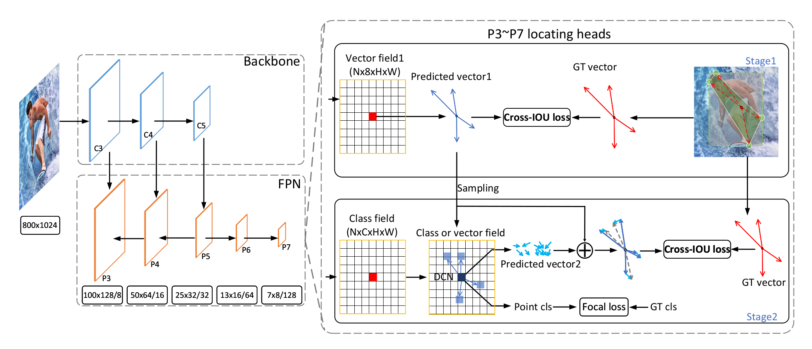

# 公众号内容拓展学习笔记（2021.4.30）

------

## :paperclip:  今日要点

1. [CVPR2021｜Anchor-free新玩法，一个head统一目标检测，实例分割，姿态估计三种任务](https://mp.weixin.qq.com/s/WhTDs3IENk1gjdp8G9gTgQ)         :star::star:
   - Abstract: 统一目标检测、实例分割、姿态估计任务的位置敏感网络LSNet
   - Paper: [Location-Sensitive Visual Recognition with Cross-IOU Loss](https://arxiv.org/abs/2104.04899)
   - Code: [https://github.com/Duankaiwen/LSNet](https://github.com/Duankaiwen/LSNet)
   - Tips: 作者认为目标检测、实例分割、姿态估计都是对物体位置信息的识别，提出了LSNet，同时提出了Cross-IOU loss，进一步提高性能

2. [CVPR 2021 | 又好又快的视频异常检测，引入元学习的动态原型学习组件](https://mp.weixin.qq.com/s/FRn2prbe8V35J1QhfdwDAw)       :star::star:
   - Abstract: 一个场景模式自适应的动态原型（prototype）学习框架进行视频异常检测
   - Paper: [Learning Normal Dynamics in Videos with Meta Prototype Network](https://arxiv.org/abs/2104.06689)
   - Code: [https://github.com/ktr-hubrt/MPN](https://github.com/ktr-hubrt/MPN)
   - Tips: 通过场景模式自适应的动态原型（prototype）学习框架，实时的学习视频中的正常模式，来辅助视频帧的预测，然后通过视频帧的预测误差和原型与输入特征的距离来检测异常。

3. [Google发布语义分割新数据集！顺带开发个模型屠榜，已被CVPR2021接收](https://mp.weixin.qq.com/s/iHsr9rjh3CKupQRDZP-cwg)       :star::star:
   - Abstract: Google提出一个全新的模型ViP-DeepLab，旨在同时解决单眼深度估计和视频全景分割
   - Paper: [ViP-DeepLab: Learning Visual Perception with Depth-aware Video Panoptic Segmentation](https://arxiv.org/abs/2012.05258)
   - Code: [https://github.com/joe-siyuan-qiao/ViP-DeepLab](https://github.com/joe-siyuan-qiao/ViP-DeepLab)
   - Tips: ViP-DeepLab具有简单的体系结构，可在视频全景分割，单眼深度估计以及多对象跟踪和分割方面实现最先进的性能，这个模型也能帮助进一步研究对2D场景中的真实世界。

4. [赛尔原创 | N-LTP：基于预训练模型的中文自然语言处理平台](https://mp.weixin.qq.com/s/vs79nm5nubNu05ttl1Jxqg)       :star::star:
   - Abstract: 基于预训练模型的中文自然语言处理平台N-LTP
   - Paper: [N-LTP: A Open-source Neural Chinese Language Technology Platform with Pretrained Models](https://arxiv.org/abs/2009.11616)
   - Code: [https://github.com/HIT-SCIR/ltp](https://github.com/HIT-SCIR/ltp)
   - Tips: 这是一个基于PyTorch的中文自然语言处理的神经自然语言处理工具包，它是基于SOTA预训练模型构建的

5. [丝滑！CVPR 2021 视频插帧论文+开源代码汇总](https://mp.weixin.qq.com/s/XEh_RWhpvtKEKMFUFS9baQ)       :star::star:
   - Abstract: 视频插帧相关主题的三篇论文
   - Code: [https://github.com/DWCTOD/CVPR2021-Papers-with-Code-Demo](https://github.com/DWCTOD/CVPR2021-Papers-with-Code-Demo)
   - Tips: 视频插帧相关主题，下面给出一个动画视频的插帧框架，有点儿意思

6. [只会“搬砖”的机器人最成功：波士顿动力最新机器人Stretch](https://mp.weixin.qq.com/s/q5CJGf9virtP5CgnjuxOdg)       :star::star:
   - Abstract: 波士顿动力公司推出了最新的仓储搬运机器人Stretch
   - website: [https://www.bostondynamics.com/](https://www.bostondynamics.com/)
   - Tips: Stretch是继第一个四足机器人Spot后，波士顿动力公司的第二个商业产品，有更大的潜力让Boston Dynamics成为一家盈利的公司

7. [论文创新没有思路？看这篇就够了！](https://mp.weixin.qq.com/s/QNELwK2PwgI2SgmR1U-hxw)       :star::star:
   - Abstract: 论文创新的大致思路
   - Tips: 拓展知识面看我的公众号也阔以。。。

## :paperclip:  Others

- 由于图片权限问题，[GitHub](https://github.com/xiaoxuebajie/dairly_learning)是完整版，可以点点 star
- 星标的数量是与个人相关程度，不代表文章内容的好坏
- 关注我的[个人网站](http://www.cvbds.cn/)
- 关注我的[CSDN](https://blog.csdn.net/xiaoxuebajie)博客
- 关注我的[哔哩哔哩](https://space.bilibili.com/424394389)
- 关注我的公众号CV伴读社

