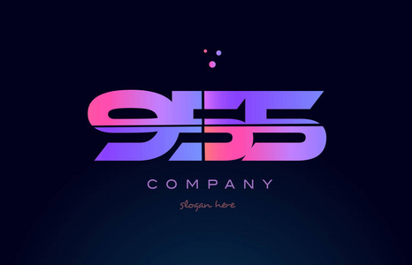

# 公众号内容拓展学习笔记（2022.3.3）

------

## :paperclip:  今日要点

1. [商汤提出cosFormer：在注意力中重新思考Softmax](https://mp.weixin.qq.com/s/fpDKnaJvTWZhRmGRvk4Yvg)         :star::star:
   - Abstract: 商汤提出cosFormer：在注意力中重新思考Softmax
   - Paper: [COSFORMER : RETHINKING SOFTMAX IN ATTENTION](https://arxiv.org/pdf/2202.08791.pdf)
   - Tips:  COSFORMER 的关键思路在于将不可分解非线性 softmax 操作替换为具有可分解非线性重加权机制的线性操作。该模型适用于随机注意力和交叉注意力，并且输入序列长度具有线性时间和空间复杂度，从而在建模长程依赖中显示出强大的能力。

2. [一张照片就能生成3D模型，GAN和自动编码器碰撞出奇迹，苏黎世联邦理工学院出品](https://mp.weixin.qq.com/s/i7vBrs1ODVDhU5NkmL3Rmg)       :star::star:
   - Abstract: 一张照片就能生成3D模型，GAN和自动编码器碰撞出奇迹，苏黎世联邦理工学院出品
   - Paper: [Pix2NeRF: Unsupervised Conditional π-GAN for Single Image to Neural Radiance Fields Translation](https://arxiv.org/abs/2202.13162)
   - Code: [https://github.com/sxyu/pixel-nerf](https://github.com/sxyu/pixel-nerf)
   - Tips: 首先，自动编码器可以通过无监督学习，来获取输入图像的隐藏特征，包括物体姿态和物体形状，并利用学习到的特征重建出原始的数据；然后，再利用GAN来通过姿态和形状数据，重构出与原来的物体形状不同的新视图。

3. [CVPR 2022 | 南开程明明团队和天大提出LD：目标检测的定位蒸馏](https://mp.weixin.qq.com/s/dxss8RjJH283h6IbPCT9vg)       :star::star:
   - Abstract: 南开程明明团队和天大提出LD：目标检测的定位蒸馏
   - Paper: [Localization Distillation for Dense Object Detection](https://arxiv.org/abs/2102.12252)
   - Code: [https://github.com/HikariTJU/LD](https://github.com/HikariTJU/LD)
   - Tips: : 把用于分类head的KD（知识蒸馏），用于目标检测的定位head，即有了LD （Localization Distillation）。LD使得logit mimicking首次战胜了Feature imitation。分类知识与定位知识的蒸馏应分而治之、因地制宜。

4. [新目标检测框架 | 基于改进的one-shot的目标检测](https://mp.weixin.qq.com/s/mEItJ5cZzFC3dr_64vokCQ)       :star::star:
   - Abstract: 基于改进的one-shot的目标检测OSCD
   - Paper: [OSCD: A one-shot conditional object detection framework](https://www.sciencedirect.com/science/article/pii/S0925231220306779?via%3Dihub)
   - Tips: 研究者就提出了将检测问题更好地命名为one-shot条件目标检测。并设计了一个基于可学习度量和two-stages检测模型的通用one-shot条件目标检测框架(OSCD)。

5. [CVPR 2022放榜！2067篇论文被接收，Masked Autoencoders 能否夺得最佳论文？](https://mp.weixin.qq.com/s/_FOLwn_0IHsme8iQoHBipA)       :star::star:
   - Abstract: Auto-Sklearn：CVPR 2022放榜！2067篇论文被接收，Masked Autoencoders 能否夺得最佳论文？
   - Paper: [Masked Autoencoders Are Scalable Vision Learners](https://arxiv.org/abs/2111.06377)
   - Tips: 这篇论文展示了一种被称为掩蔽自编码器（masked autoencoders，MAE）的新方法，可以用作计算机视觉的可扩展自监督学习器。MAE 基于两个核心理念：研究人员开发了一个非对称编码器 - 解码器架构，其中一个编码器只对可见的 patch 子集进行操作（没有掩蔽 token），另一个简单解码器可以从潜在表征和掩蔽 token 重建原始图像。

6. [最新 955 不加班的公司名单（2022版）](https://mp.weixin.qq.com/s/kNIDs-4baFh1QakSgxCHFg)       :star::star:
   - Abstract: 最新 955 不加班的公司名单（2022版）
   - Tips: 以下公司名单，基本不属于 996 的公司，相对接近 955/965 的水平，但是依旧要看部门和地区，不能保证完全准确性。

## :paperclip:  Others

- 由于图片权限问题，[GitHub](https://github.com/xiaoxuebajie/dairly_learning)是完整版，可以点点 star
- 星标的数量是与个人相关程度，不代表文章内容的好坏
- 关注我的[个人网站](http://www.cvbds.cn/)
- 关注我的[CSDN](https://blog.csdn.net/xiaoxuebajie)博客
- 关注我的[哔哩哔哩](https://space.bilibili.com/424394389)
- 关注我的公众号CV伴读社

